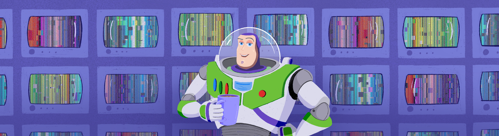

# 3DViewer v2.0

> При старте работы над проектом просим вас постараться хронометрировать время работы над проектом.
> По завершении работы над проектом просим вас ответить на два вопроса [в этом опросе](https://forms.gle/u5xgN2MfJUcY1soP8)

Implementation of 3DViewer v2.0

The russian version of the task can be found in the repository.

## Contents

1. [Chapter I](#chapter-i) \
   1.1. [Introduction](#introduction)
2. [Chapter II](#chapter-ii) \
   2.1. [Information](#information)
3. [Chapter III](#chapter-iii) \
   3.1. [Part 1](#part-1-3dviewer-v20) \
   3.2. [Part 2](#part-2-bonus-settings) \
   3.3. [Part 3](#part-3-bonus-record)

## Chapter I

Somewhere near a coffee machine in the 90s:

*-- It's simple, my friend. It will be a cartoon about toys, like the short one that brought us the Oscar. The natural shape of the toys will fit perfectly with the low-poly 3d models we're able to animate. And these are toys after all, so poor facial expressions won't be critical. There's already a plot in my mind. Let's bring them to life! The story will be based on the relationship between the toys and a child.*

*- Sounds familiar and interesting!*

*-- It is. You should go to your team asap and start developing 3d modelling software. If we want to make this cartoon, we need our own software tools. The ones that on the market will only allow us to animate a wooden pyramid, and even then in the form of a cube.*

*- You know, I think the same. I even have several ideas somewhere.*

*-- I think we should start with the most important thing - the preview screen. Good luck!* - having said these words, Lasseter finished his coffee, washed his mug and left the break room, leaving you alone with your thoughts. The door closed slowly after he had gone, leaving only the painfully familiar white glow in the cracks.*

*- It would be convenient to prepare several rendering strategies in advance...* - you said thoughtfully out loud, - *And also hide all the business logic implementation behind some kind of facade, then it will be easier to work with the UI. And commands to handle user actions, right, right...* - the sudden sound of a dial-up modem somewhere in the distance distracted you from your thoughts. You had to urgently discuss the task with the team and design the architecture of the future application. Time waits for no one! \
You opened the door and a bright light flooded your face. Your determination is unshakable; the planned cartoon is destined to make history!

## Introduction

In this project you’ll need to implement an application for viewing 3D wireframe models in C++ in the object-oriented programming paradigm, implementing the same functions as the previously developed application in 3DViewer v1.0 project.

## Chapter II

## Information

### Design patterns

Each human activity, such as cooking or nuclear physics experiments, has a set of established practices that deal with basic elementary tasks. They do not require an individual approach and are usually resolved by well-established approaches developed over time, based on the experience of previous cooks or nuclear physicists. For example, baking a pie, even an unusual one, will most likely require dough whose cooking technology is known in advance and usually does not need some creativity. It's the same with programming, when designing you often have elementary tasks that a huge number of programmers have faced before you, and their experience has developed into established design patterns.

**Design pattern** describes a frequently repeated application design problem and its way of solving, which is universal to that problem.
In other words, a design pattern for a programmer is nothing but a building block, an elementary unit that is implemented when a typical subtask occurs within a project.

Design patterns are usually divided into three groups: creational, structural and behavioral patterns. See materials for more information about design patterns. \
You have already encountered the use of established practices (patterns) in application design in the SmartCalc v2.0 project (MVC pattern). Just as a reminder, MVC in some form or another is one of the most common solutions in terms of code structuring during UI application development.
The user interface and the business logic with its controller are usually split into two different global domains: the interface domain and the business logic domain.

The interface domain is only responsible for displaying the interface and passing commands to the business logic domain. Data loaded from a file should not be stored in the interface domain.

The business logic domain is responsible for the main functionality of the system. This is where the loaded data is stored and all the operations with it are performed. This domain is also where the rendering is done.

You can see an example of a suggested class diagram for a business logic domain in materials.

## Chapter III

## Part 1. 3DViewer v2.0

Develop a program to visualise the 3D wireframe models.

- The program must be developed in C++ language of C++17 standard
- The program code must be located in the src folder
- The program must be built with Makefile which contains standard set of targets for GNU-programs: all, install, uninstall, clean, dvi, dist, tests. Installation directory could be arbitrary, except the building one
- The program should be developed according to the principles of object-oriented programming; the structured programming approach is not allowed
- Prepare full coverage of modules related to model loading and affine transformations with unit-tests
- There should be only one model on the screen at a time
- The program must provide the ability to:
    - Load a wireframe model from an obj file (vertices and surfaces list support only).
    - Translate the model by a given distance in relation to the X, Y, Z axes.
    - Rotate the model by a given angle in relation to its X, Y, Z axes.
    - Scale the model by a given value.
- GUI implementation, based on any GUI library with API for C++ (Qt, SFML, GTK+, Nanogui, Nngui, etc.)-
- The graphical user interface must contain:
    - A button to select the model file and a field to output its name.
    - A visualisation area for the wireframe model.
    - Button/buttons and input fields for translating the model.
    - Button/buttons and input fields for rotating the model.
    - Button/buttons and input fields for scaling the model.
    - Information about the uploaded model - file name, number of vertices and edges.
- The program must correctly processes and allows user to view models with details up to 100, 1000, 10,000, 100,000, 1,000,000  vertices without freezing (a freeze is an interface inactivity of more than 0.5 seconds)
- The program must be implemented using the MVC pattern, and also:
    - there should be no business code in the view code
    - there should be no interface code in the controller and the model
    - controllers must be thin
- There should be at least three different design patterns (e.g. facade, strategy and command)
- Classes must be implemented within the `s21` namespace
- To perform affine transformations, use the matrices from the library of the previous s21_matrix+ project

## Part 2. Bonus. Settings

- The program must allow customizing the type of projection (parallel and central)
- The program must allow setting up the type (solid, dashed), color and thickness of the edges, display method (none, circle, square), color and size of the vertices
- The program must allow choosing the background color
- Settings must be saved between program restarts

## Part 3. Bonus. Record

- The program must allow saving the captured (rendered) images as bmp and jpeg files.
- The program must allow recording small screencasts - the current custom affine transformation of the loaded object into gif-animation (640x480, 10fps, 5s) by a special button
